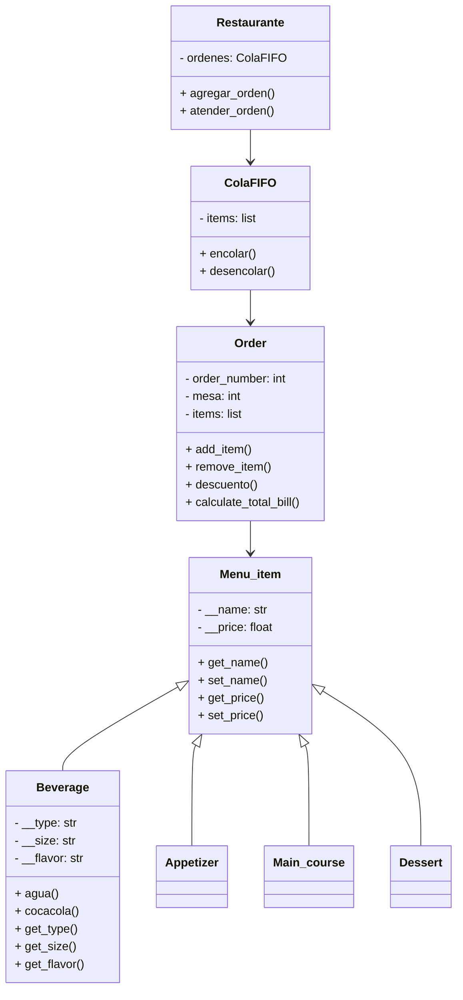
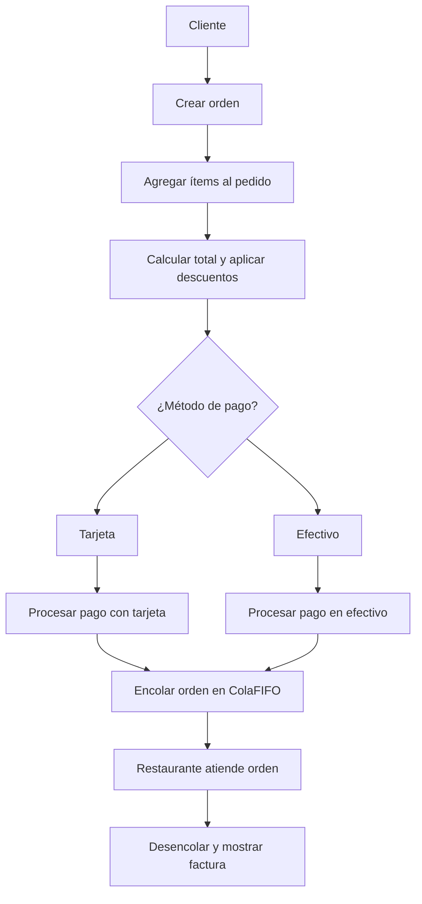

## Reto 7: 
1. The `restaurant class` *revisted* like for the third time. 
  + Add the proper data structure to manage multiple orders (maybe a FIFO queue)
  + Define a **named tuple** somewhere in the menu, e.g. to define a set of items.
  + Create an interface in the order class, to create a new menu, aggregate the functions for add, update, delete items. All the menus should be stored as JSON files. (use dicts for this task.)

# Sistema de Restaurante en Python

Este proyecto es un sistema de restaurante que usa  manejo de archivos **JSON**, uso de `namedtuple`, y estructuras de datos como **colas FIFO** implementadas manualmente.

## Estructura del Proyecto

- `menu.json`: Archivo externo donde se guarda el menú del restaurante (bebidas, entradas, platos fuertes, postres, etc.).
- `restaurante.py`: Archivo principal del sistema. Incluye:
  - Clases `Menu_item`, `Beverage`, `Appetizer`, `Main_course`, `Dessert`, etc.
  - Clases `Order`, `Tarjeta`, `Efectivo`, y `Restaurante`.
  - Implementación manual de una estructura **Cola FIFO**.
  - Uso de `namedtuple` para representar ítems del menú de forma alternativa.
  - Ejemplos de uso al final para probar las funciones.

## ¿Por qué una cola FIFO manual?

Aunque Python tiene la librería `queue`, aquí se implementa una cola FIFO **paso a paso** desde cero para:

- Comprender cómo funciona internamente una cola.
- Aprender a programar métodos como `encolar`, `desencolar`, `verificar si está vacía`.
- Simular la lógica real de atención de órdenes en un restaurante: **el primero en llegar es el primero en ser atendido (First-In, First-Out)**.

Esto refuerza la comprensión de estructuras de datos y el pensamiento lógico.

    
## Flujo del sistema

